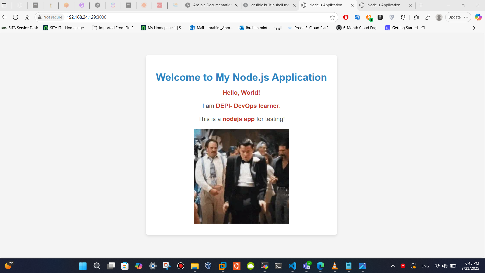
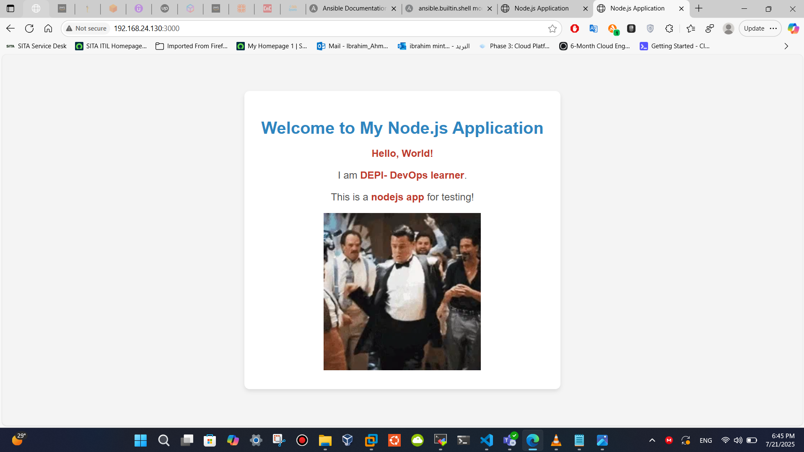
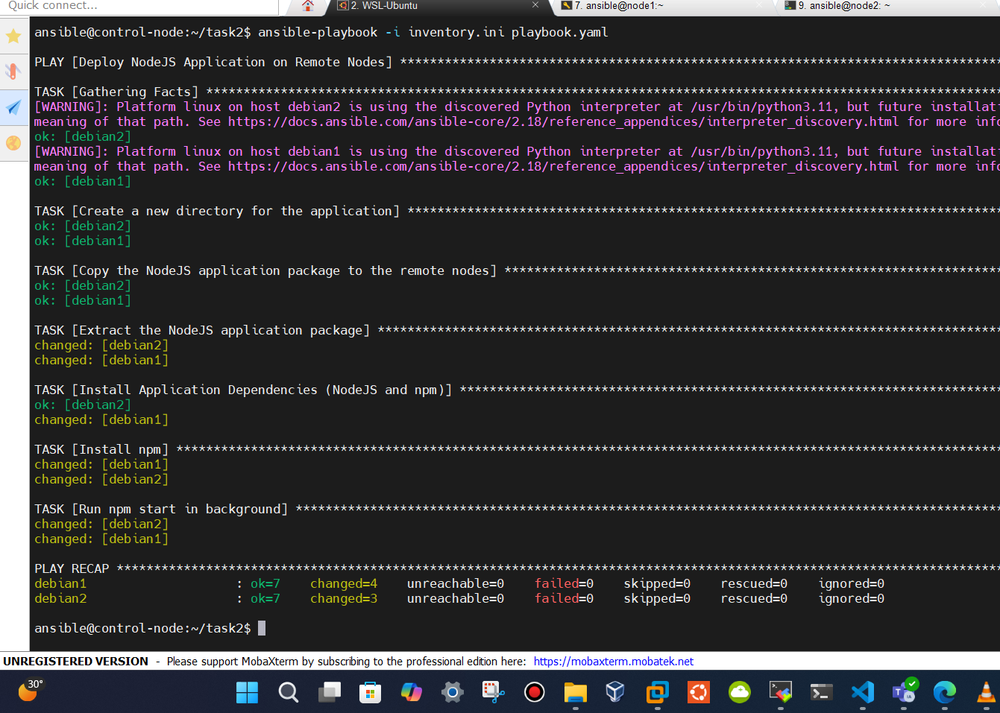
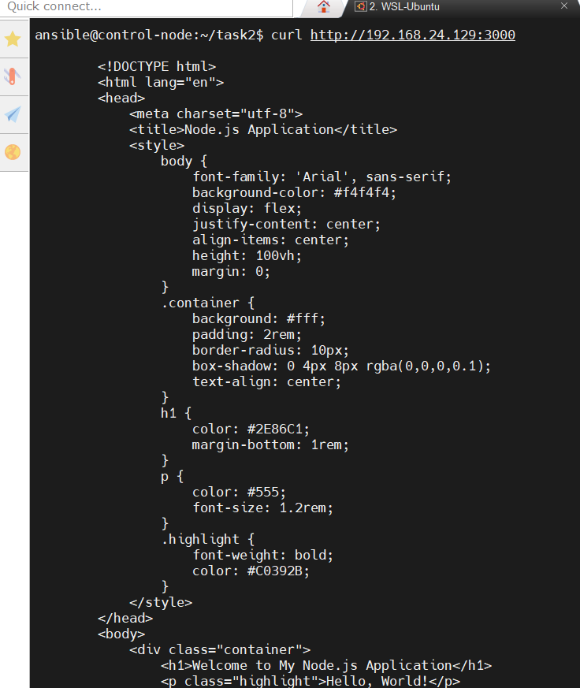
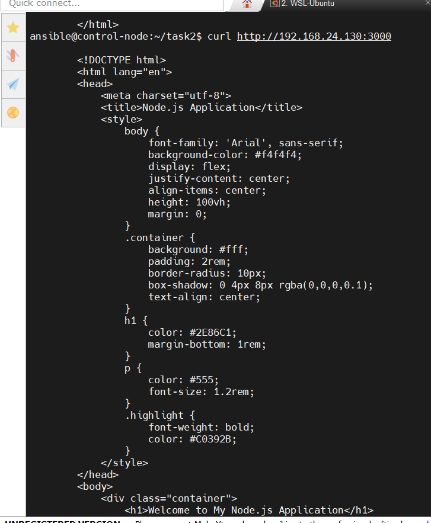

# 🚀 NodeJS Application Deployment using Ansible

This project provides an **Ansible playbook** to automate the deployment of a NodeJS application on remote **Debian-based** nodes. It includes inventory configuration, installation steps, and background execution of the app.


## 📁 Project Structure

```
.
├── inventory.ini          # Inventory file with host groupings
├── playbook.yaml          # Ansible playbook for deployment
├── nodejs-app-1.0.0.tgz   # NodeJS application package (place manually)
├── README.md              # This file
├── node1-server.png       # Screenshot of Node 1
├── node2-server.png       # Screenshot of Node 2
└── output.png             # Output screenshot
```

---

## 🔧 Inventory Setup

The `inventory.ini` defines the target machines and groups:

```ini

[debian]
debian1 ansible_host=192.168.24.129 ansible_user=ansible
debian2 ansible_host=192.168.24.130 ansible_user=ansible

```

> ⚠️ **Note**: The playbook targets the `debian` group. Ensure group names match exactly in both inventory and playbook.


---

## 📘 Playbook Setup (`playbook.yaml`)

Below is the Ansible playbook used to deploy the NodeJS application:

```yaml
---
- name: Deploy NodeJS Application on Remote Nodes
  hosts: debian
  become: yes
  tasks:

    - name: Create a new directory for the application
      ansible.builtin.file:
        path: /home/ansible/myapp
        state: directory

    - name: Copy the NodeJS application package to the remote nodes
      ansible.builtin.copy:
        src: /home/ansible/task2/nodejs-app-1.0.0.tgz
        dest: /home/ansible/myapp/

    - name: Extract the NodeJS application package
      ansible.builtin.unarchive:
        src: /home/ansible/myapp/nodejs-app-1.0.0.tgz
        dest: /home/ansible/myapp/
        remote_src: yes

    - name: Install Application Dependencies (NodeJS and npm)
      ansible.builtin.apt:
        update_cache: yes
        pkg:
          - nodejs
          - npm

    - name: Install npm packages
      community.general.npm:
        path: /home/ansible/myapp/package/

    - name: Run npm start in background
      ansible.builtin.shell:
        cmd: nohup npm start &
        chdir: /home/ansible/myapp/package/
```

This playbook ensures NodeJS is installed, dependencies are fetched, and the application is started in the background.


---

## 📜 What the Playbook Does

The `playbook.yaml` performs the following tasks **on Debian-based nodes**:

1. **Create a directory** for the application:
   ```
   /home/ansible/myapp
   ```

2. **Copy the NodeJS package** (`nodejs-app-1.0.0.tgz`) to the target directory.

3. **Extract** the package contents.

4. **Install NodeJS and npm** using `apt`.

5. **Install app dependencies** using `npm install`.

6. **Run the app** in the background using:
   ```bash
   nohup npm start &
   ```

---

## ▶️ How to Use

### Prerequisites

- Ansible installed on your control node.
- Passwordless `sudo` access for `ansible` user on target nodes.
- `nodejs-app-1.0.0.tgz` present on the control node under:
  ```
  /home/ansible/task2/
  ```

### Run the Playbook

```bash
ansible-playbook -i inventory.ini playbook.yaml
```

---

## 📝 Notes

 ```
- You can adjust file paths and package names based on your environment.
- Ensure all remote nodes can be SSH'd into using the `ansible_user`.

---

## 🖼️ Windows Screenshots

| Node 1 Server | Node 2 Server | Output |
|---------------|---------------|--------|
|  |  |  |

---

## 🖼️ Curl Screenshots

| Curl Node 1 | Curl Node 2 |
|------------|-------------|
|  |  |

---

## 📌 Summary

This Ansible project helps you easily automate the setup and deployment of a NodeJS application on Debian-based remote servers.